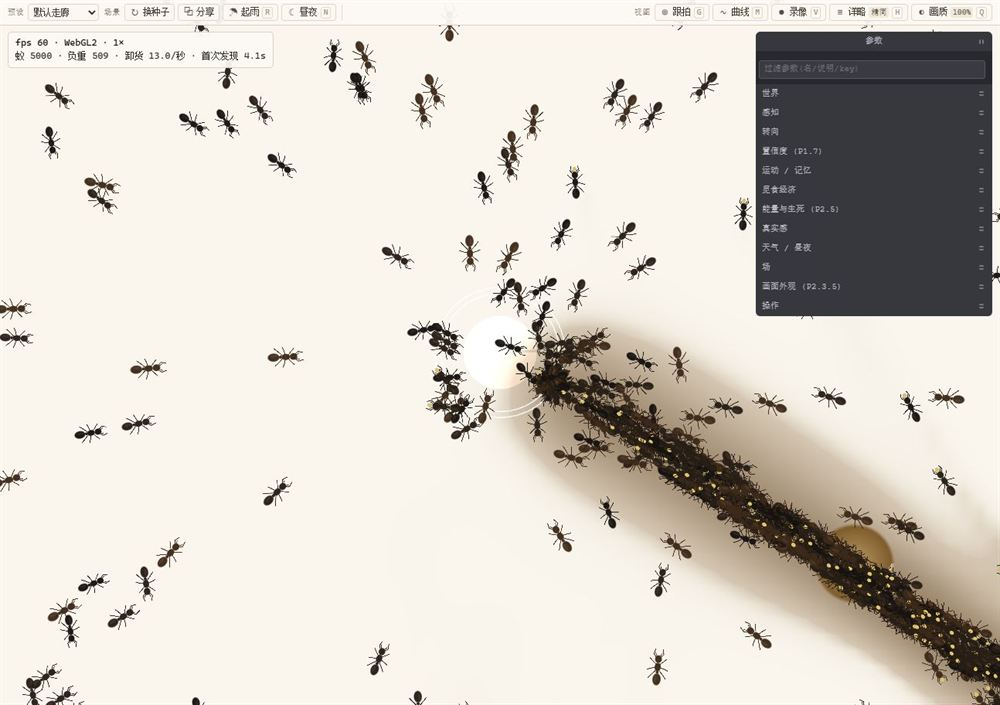
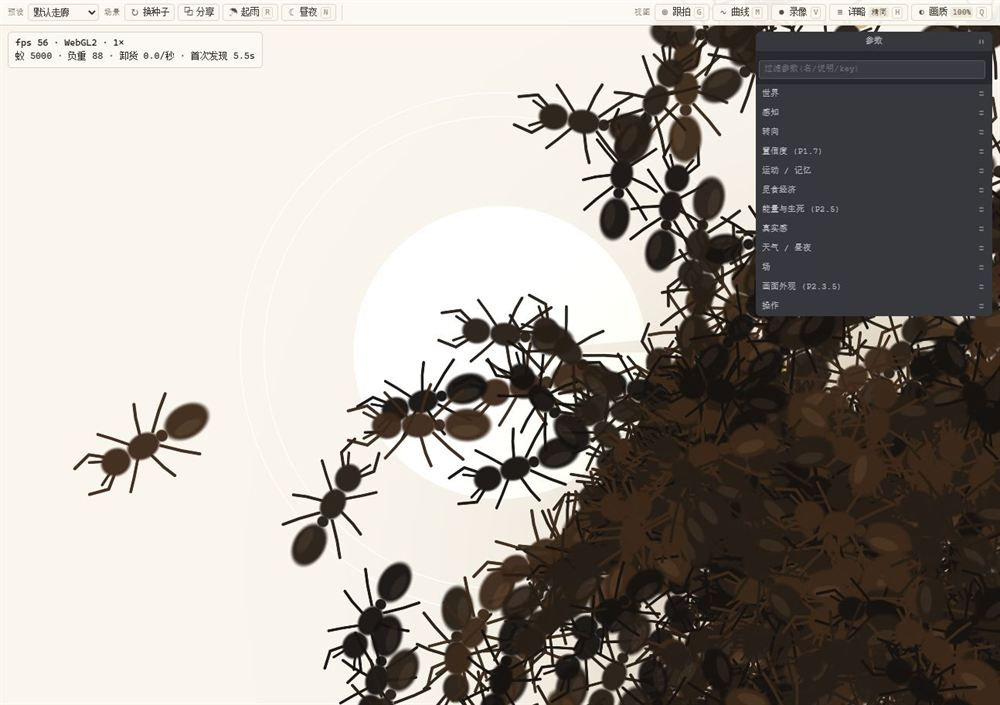
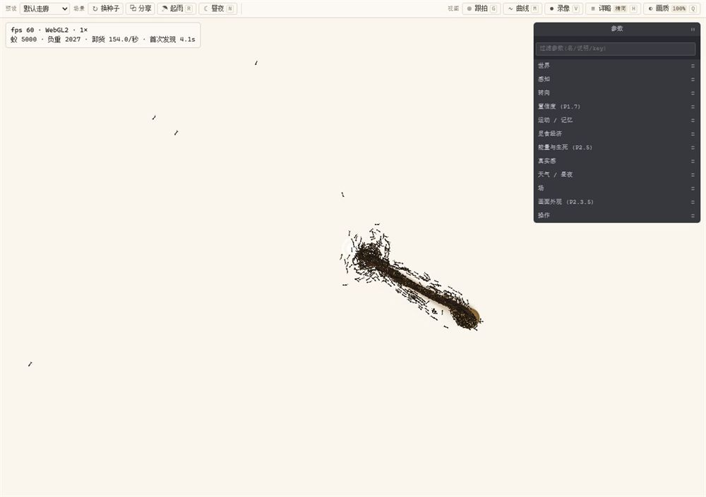

# Antworld · 蚂蚁世界

> **一窝会自己修路的蚂蚁。** 5000 只工蚁没有指挥官，只有三件事：**闻到信息素**、**记得自己走过的路**、**饿不饿**。
> 觅食走廊、绕墙缺口、避险改道、昼夜节律、种群涨缩——全部从这些局部规则里长出来，**没有一处是画好的**。



*两粒种子落在白纸上，60 秒后被踩成一条墨色走廊。路是踩出来的，不是预设的。*

| | |
|:--|:--|
| **画面** | 白纸 + 墨渍走廊 · 近黑虫体（三段细腰 · 膝状触角 · 放大出六足）· **会被啃出缺口的种子** |
| **机制** | physarum 三触角寻路 · 路径积分 · 个体路线记忆 · 报警信息素与捕食者 · 内源钟昼夜 · 雨风冲刷 · 能量与生死 |
| **可复现** | 确定性仿真：同一颗种子**逐位相同**（校验和四钉）· 16 项无头门禁守着，改坏了当场报红 |
| **技术** | WebGL2（不支持时自动兜底 Canvas2D）· SoA 热路径零分配 · Vite · 运行时只有一个第三方依赖（tweakpane 参数面板） |

---

## 30 秒跑起来

```bash
npm install
npm run dev        # 打开 http://localhost:5300
```

- 打开就是出厂场景：**5000 只蚁 · 2000×1300 世界 · 两粒种子（一近一主）**。什么都不用调。
- 端口固定 5300：本机 Windows 保留端口段含 5173，Vite 默认端口会 `EACCES`。

## 先看这五件事

1. **什么都不按，等 60 秒。** 蚂蚁从乱走开始，把两粒种子各自踩成一条走廊。信息素渗不过墙，所以路会贴着墙脚走。
2. **按 `W` 画一道墙**，把巢和主源隔开。看蚁群从缺口重新成路——你会亲眼看到「路」被几何重新选择一次。
3. **按 `F` 点一只正在负重的蚁**（或直接按 `G`）。镜头跟住它，检视卡讲出它这一生的故事：出发 / 发现 / 到家 / 迷路 / 超时返巢 / 死亡。
4. **按 `P` 在主路上放一只捕食者。** 圈内被捕杀、原地喷报警信息素，几分钟内主流量改走圈外；再点一次移除，报警云几十秒散尽、路线合拢回来。
5. **按 `R` 等一场雨。** 起雨前 40 秒全群抢收（出巢率与搬运速度同时飙升），雨一落地立刻收场，然后看雨后重建。



*蚁体长是**世界单位**：缩放时蚂蚁真的会跟着变大变小，不是贴在屏幕上的固定像素。*

---

## 界面：六个位置，各管一件事



| 位置 | 内容 | 备注 |
|:--|:--|:--|
| **顶部（整宽）** | 预设下拉 · 换种子 · 分享 · 起雨 · 昼夜 ‖ 跟拍 · 曲线 · 录像 · 详略 · 画质 | 每个按钮上印着自己的快捷键 |
| **左上** | HUD 读数：fps / 后端 / 倍速 / **达成 %** / 种群 / 经济 | `H` 三档，出厂只有 2 行 |
| **右上** | 参数面板（91 项 / 11 组），**只管参数** | 出厂全折叠；行多到装不下时自己出滚动条 |
| **左下** | 最近 60 秒统计曲线 | `M` 开关 |
| **底部中** | 一句话反馈（toast） | 做了什么、为什么没做，都会说给你 |
| **点一只蚁** | 检视卡：负载 / 朝向 / 回家向量 / 负重计时 / 记忆航点 | 浮层，自动让开右侧面板，不挡任何按钮 |

## 怎么玩

**键盘**

| 键 | 做什么 |
|:--|:--|
| `F` `W` `E` `P` | 切工具：食物 · 画墙 · 擦墙 · 捕食者 |
| `1` `2` `3` `4` `0` | 倍速 0.125× / 1× / 4× / 64× · 暂停或继续 |
| `R` `N` `X` | 排一场雨 · 把内源钟推到对面（昼↔夜）· 清空所有墙 |
| `G` `M` `V` | 跟拍一只蚁 · 展开统计曲线 · 录一段 webm |
| `H` `Q` | HUD 详略三档 · 出画分辨率 100 / 75 / 55% |
| `/` `Esc` | 跳进参数过滤框 · 第一下清词，第二下退出输入 |

**鼠标**

| 动作 | 做什么 |
|:--|:--|
| 拖拽（任意键） | 平移视野。画墙/擦墙档下**左键拖拽 = 画墙** |
| 左键单击 | 使用当前工具。食物档下**点中蚂蚁** = 检视 + 跟拍，**点空地** = 放一粒种子 |
| 右键单击 | 移除食物 · 取消跟拍 |
| 滚轮 | 缩放（全景的 0.3×~60×，蚂蚁跟着变大变小） |

> 快捷键只认非输入控件：焦点在过滤框里时 `f` `w` `e` `p` `1-4` 都是打字，不是命令。

## 换场景：顶栏左端的下拉（或 `?preset=`）

| 预设 | `?preset=` | 你会看到 |
|:--|:--|:--|
| 默认走廊 | `default` | 一近一主两块种子，从零铺出主走廊 |
| 迷宫 | `maze` | 梳齿墙：信息素如何翻过几何障碍选出通道 |
| 双源竞争 | `twoSource` | 近处小源 vs 远处 10 倍大源：「省事」与「值得」怎么分票 |
| 断口剂量 | `breakpoint` | 一堵墙开三个宽窄不同的断口：走廊灌进哪个口 |
| 饥荒生存 | `famine` | 又远又小的食源 + 开能量代谢：种群随储备涨缩 |

## 地址栏就是另一套控制面板

| 参数 | 作用 |
|:--|:--|
| `?seed=424242` | 换随机种子。**同一个种子 = 同一个世界**，逐位可复现 |
| `?zoom=20` | 把相机停在「全景的 20 倍」上（换窗口尺寸也仍然成立） |
| `?follow=1` · `?inspect=7` | 开局就跟拍 · 指着第 7 只蚁看它记住的那条线 |
| `?food=999999999` · `?food=200` | 管饱（做长程实验）· 快速断粮 |
| `?survivalMode=1` | 打开能量与生死。**出厂是关的**，关着时仿真与以前逐位相同 |
| `?speed=16` · `?renderScale=0.75` · `?stepBudgetMs=24` | 倍速 · 出画分辨率 · 每帧给仿真的墙钟预算 |

面板里 **91 项参数全都能这样从地址栏覆盖**（当前画面点「分享」就能带走整条链接）。

> 想看旧画面：`?inkMode=0&antStyle=0&foodLook=0` 三个一起关 ⇒ **逐字节**退回黑底加光版（SHA256 已证）。

---

## 性能：倍速的天花板是算术，不是工程

- 本机单核实测 **ms/步 ≈ 0.163 + 0.000587 × 蚁数** ⇒ 出厂 5000 蚁 ≈ 3.1 ms ⇒ 纯仿真上限 **5.4×**。
- 整帧（含信息素场与调度）另测得 292 步/秒 = **4.9×**。HUD 那行「达成 %」对着实测步/秒算，跑不满就是跑不满。
- 想要 16× 得降到 ≤1500 只，8× ≤3270 只，64× ≤160 只 —— 这是算术，不是「再优化一下」能补的。
- `Q` 画质是唯一砍得动 GPU 填充率的旋钮（大窗口 / 高分屏 / 核显吃不住时按）。

## 代码地图

```
core/     参数 schema（91 项，唯一登记处）· 场景预设布局 · 随机流
sim/      蚂蚁行为 · 蚁群 SoA 容器 · 信息素场 · 天气与昼夜
render/   WebGL2 / Canvas2D / PNG 三条路径 + look.js（形状与色表唯一登记处）
ui/       toolbar 顶栏 · panel 参数 · hud 读数 · graph 曲线 · inspector 单蚁 · recorder 录像 · story 事件
app.js    相机 · 工具 · 主循环编排（所有交互都在这里接线）
```

## 质量门禁（改动后全绿才算交付）

| 命令 | 钉什么 |
|:--|:--|
| `node perf_check.mjs` | **校验和四钉** + ms/步：sim 被悄悄改动了，第一位数字就会变 |
| `node look_check.mjs` | 画面外观 62 断言（含**没有 GPU 也能跑**的 GLSL 静态 lint） |
| `node frame_check.mjs` · `node pace_check.mjs` | 渲染每帧预算 · 倍速与降档的账 |
| `node preset_check.mjs` · `node stats_check.mjs` | 五个预设与出厂剂量 · 观测层必须只读 sim |
| `node survival_check.mjs` | 能量与生死（32/3，那三条是**预登记保留的红**） |
| `node smoke.mjs` | 冒烟 |

其余 8 项（墙 / 捕食者 / 昼夜 / 光污染 ×3 / 感知 / 记忆）与逐格读数见 `docs/HANDOVER.md` §2、`METRICS.md`。
**已知 FAIL 必须逐条有交代，绝不为凑绿改判据。**

## 文档地图

| 文档 | 回答什么 |
|:--|:--|
| `README.md` | 怎么用（本文） |
| `METRICS.md` | **每个机制的实测数据、判据与更正**——数据以它为准 |
| `ROADMAP.md` | 计划、剪枝，以及「为什么是这个顺序」 |
| `docs/ANT_BIOLOGY.md` | 真实蚂蚁生物学对照：机制该不该像、参数该往哪儿调 |
| `docs/HANDOVER.md` | 交接快照：命令表、现行基线、技术债 |

## 已知边界（不藏）

- **模型缺需求侧门控**：饥荒下蚁群反而先放弃**近**源（近处还剩 36% 时流量已经搬去远处）。真实蚁靠交哺拒绝与
  return-rate 招募「够吃就停」，这条已立项 P2.7。
- **5 万蚁 @60fps 未达成**：实测 0.61× 实时，规模化路线（WASM / worker 分片 / GPU）还没选。
- **录像没端到端验过**：「真的存下一个可播放的 webm」这一步要弹保存框，至今只在代码层验过状态机。
- **画面尺寸是标称值**：`antLen` 这类旋钮按「全景里读得出触角 + 不吃掉帧预算」定的，不是从真实工蚁体长反推的比例尺。